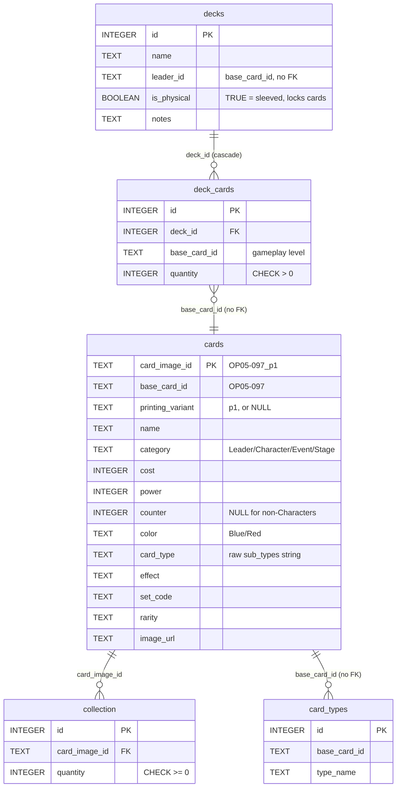
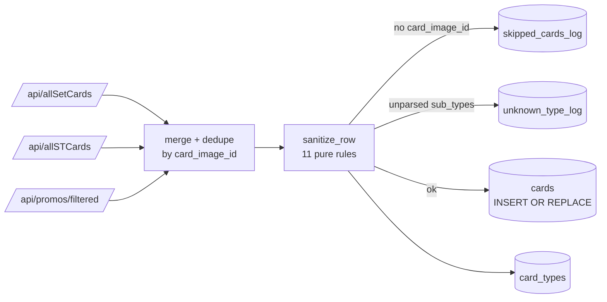

# Design Reference

What the system **is**. For *why* it's this way, see [notes/DECISIONS.md](notes/DECISIONS.md).
For current status and how to run it, see [README.md](README.md).

Reflects the schema as built. Phase 1 adds three more tables — those are specced
in [PHASE_1.md](PHASE_1.md) and move here once they exist.

---

## 1. Goals

- Track card inventory at **printing level** — base art, alt arts and reprints are distinct.
- Import decks from Limitless TCG paste format.
- Distinguish cards locked in sleeved decks from cards free to use.
- Show deck completion (owned vs missing) for any decklist, including decks you can't yet build.
- Shareable as a downloadable app — not hosted, not multi-user.

**Non-goals (v1):** condition/grading, price history, hosting, multi-user, Japanese cards.

---

## 2. Tech stack

| Layer | Choice |
|---|---|
| App shell | Tauri |
| UI | React or Svelte — decided at Phase 3 |
| Database | SQLite |
| Sync + CLI | Python |
| Card data | OptcgAPI (`https://optcgapi.com`, override with `OPTCG_API_BASE`) |

---

## 3. Core mental model

The single most important distinction in the project:

| | Keyed on | Example | Used by |
|---|---|---|---|
| **Printing** | `card_image_id` | `OP05-097_p1` | Collection — the physical card in your binder |
| **Gameplay card** | `base_card_id` | `OP05-097` | Decks — the card as the rules see it |

Every printing of a card shares one `base_card_id`. A decklist never says which
printing is sleeved, because in the game they're identical.

**Availability is computed, never stored:**

```
available = collection.quantity − SUM(deck_cards.quantity WHERE decks.is_physical)
```

**Collection lifecycle:** when quantity hits zero, keep the row at 0. Never delete.

**Safety rule:** if a change would make available copies negative, warn and refuse.

### Availability has three forms

Which one you want depends on the question being asked:

```
1. "What's free right now?"            (collection browser, new decks)
   available = owned − Σ(all physical decks)

2. "Can I build this specific deck?"   (deck completion view)
   available_to_X = owned − Σ(OTHER physical decks)
   missing        = max(0, needed − available_to_X)
   ← the deck's own cards count as available to itself

3. "If I broke down deck B, could I build X?"   (Phase 6+)
   available_to_X = owned − Σ(OTHER physical decks EXCEPT B)
```

Form 2 is the subtle one — forgetting that a deck's own cards count toward
itself makes every built deck report as incomplete.

---

## 4. Schema



Plus four standalone tables: `known_types` (the type vocabulary),
`unknown_type_log` and `skipped_cards_log` (sync review queues), and
`app_settings` (key/value config).

Two absent foreign keys are deliberate, not oversights: `base_card_id` is
non-unique by design, and SQLite requires a UNIQUE/PK target. Integrity is
enforced in the sync script instead. See D-008 and D-012.

### DDL

```sql
CREATE TABLE cards (
    card_image_id      TEXT PRIMARY KEY,   -- "OP05-097_p1" or "OP05-097"
    base_card_id       TEXT NOT NULL,      -- "OP05-097" — gameplay identity
    printing_variant   TEXT,               -- "p1"; NULL for the base printing
    name               TEXT NOT NULL,
    category           TEXT NOT NULL,      -- Leader / Character / Event / Stage
    cost               INTEGER,            -- NULL for Leaders
    power              INTEGER,
    counter            INTEGER,            -- NULL forced for non-Characters
    color              TEXT,               -- "Red", "Blue/Red"
    card_type          TEXT,               -- raw sub_types string
    effect             TEXT,               -- NULL allowed (vanilla cards)
    has_trigger        BOOLEAN NOT NULL DEFAULT 0,
    has_blocker        BOOLEAN NOT NULL DEFAULT 0,
    has_rush           BOOLEAN NOT NULL DEFAULT 0,
    has_double_attack  BOOLEAN NOT NULL DEFAULT 0,
    has_banish         BOOLEAN NOT NULL DEFAULT 0,
    set_code           TEXT,               -- "OP-05"
    rarity             TEXT,
    image_url          TEXT,
    last_synced        TIMESTAMP
);

CREATE TABLE card_types (
    id           INTEGER PRIMARY KEY AUTOINCREMENT,
    base_card_id TEXT NOT NULL,
    type_name    TEXT NOT NULL,
    UNIQUE(base_card_id, type_name)
);

CREATE TABLE known_types (
    type_name TEXT PRIMARY KEY,
    added_at  TIMESTAMP DEFAULT CURRENT_TIMESTAMP
);

CREATE TABLE unknown_type_log (
    log_id        INTEGER PRIMARY KEY AUTOINCREMENT,
    card_image_id TEXT NOT NULL,
    raw_sub_types TEXT NOT NULL,
    detected_at   TIMESTAMP DEFAULT CURRENT_TIMESTAMP,
    resolved      BOOLEAN NOT NULL DEFAULT 0
);

CREATE TABLE skipped_cards_log (
    log_id        INTEGER PRIMARY KEY AUTOINCREMENT,
    raw_card_data TEXT,                    -- JSON of the raw API row
    reason        TEXT NOT NULL,
    detected_at   TIMESTAMP DEFAULT CURRENT_TIMESTAMP
);

CREATE TABLE collection (
    id            INTEGER PRIMARY KEY AUTOINCREMENT,
    card_image_id TEXT NOT NULL REFERENCES cards(card_image_id),
    quantity      INTEGER NOT NULL DEFAULT 0 CHECK(quantity >= 0),
    updated_at    TIMESTAMP DEFAULT CURRENT_TIMESTAMP,
    UNIQUE(card_image_id)
);

CREATE TABLE decks (
    id          INTEGER PRIMARY KEY AUTOINCREMENT,
    name        TEXT NOT NULL,
    leader_id   TEXT,                      -- base_card_id; no FK by design
    is_physical BOOLEAN NOT NULL DEFAULT 0,
    notes       TEXT,
    created_at  TIMESTAMP DEFAULT CURRENT_TIMESTAMP,
    updated_at  TIMESTAMP DEFAULT CURRENT_TIMESTAMP
);

CREATE TABLE deck_cards (
    id           INTEGER PRIMARY KEY AUTOINCREMENT,
    deck_id      INTEGER NOT NULL REFERENCES decks(id) ON DELETE CASCADE,
    base_card_id TEXT NOT NULL,
    quantity     INTEGER NOT NULL DEFAULT 1 CHECK(quantity > 0),
    UNIQUE(deck_id, base_card_id)
);

CREATE TABLE app_settings (
    key   TEXT PRIMARY KEY,
    value TEXT
);
```

**Indexes (11):** `cards` on `base_card_id`, `category`, `color`, `set_code` and
each of the five `has_*` keyword booleans; `card_types` on `base_card_id` and
`type_name`.

---

## 5. Sync pipeline



4,459 raw rows collapse to 4,338 unique printings — the same printing
legitimately appears in more than one endpoint. Re-running the sync must never
duplicate data.

---

## 6. Sanitization rules

Pure functions in `src/sanitize.py` — no DB access, no side effects, one per rule.

| # | Function | Does |
|---|---|---|
| 1 | `normalize_null` | `"NULL"`, `"?"`, `""`, `"-"`, whitespace → `None` |
| 2 | `to_int` | Safe string→int; null-likes → `None` |
| 3 | `normalize_counter` | Int for Characters; forced `NULL` for Leader/Event/Stage |
| 4 | `normalize_colors` | `"Blue Red"` → `"Blue/Red"` |
| 5 | `normalize_attributes` | `"Slash / Special"` → `"Slash/Special"` |
| 6 | `parse_subtypes` | Longest-match against `known_types` → `(matched, leftover)` |
| 7 | `extract_printing_variant` | `"OP05-097_p1"` → `"p1"`; base printing → `None` |
| 8 | `detect_keywords` | Substring-matches `[Trigger]`, `[Blocker]`, `[Rush]`, `[Double Attack]`, `[Banish]` |
| 9 | `repair_field_shift` | Fixes upstream rows with power/sub_types misaligned (D-018) |
| 10 | `normalize_card_image_id` | Strips file extensions, folds `-variant` → `_variant` (D-019) |
| 11 | `strip_printing_suffix` | `"P-029_r1"` → `"P-029"` — the gameplay identity (D-019) |

**Sync-level behaviors** (in `sync.py`, not pure functions):

- Rows with no `card_image_id` → `skipped_cards_log`, not inserted.
- Sub-types that don't fully parse → `unknown_type_log`.
- Vanilla cards are valid — never enforce `NOT NULL` on `effect`.
- Every row stamped with `last_synced`.
- `image_url` stored exactly as the API returns it.
- DON!! cards excluded entirely — `/api/allDonCards/` is never called.

### Sub-type parsing gotcha

Longest-match matters: `"Neo Navy"` must be matched before `"Navy"`, or you get
a false `Navy` match plus `"Neo"` as leftover. `parse_subtypes` sorts known types
by length descending for exactly this reason.

---

## 7. OptcgAPI reference

There is **no** `/api/allCards/` and **no** `/api/allPromoCards/` — both 404.
Three endpoints are needed:

| Endpoint | Returns |
|---|---|
| `/api/allSetCards/` | Booster set cards (bare JSON array) |
| `/api/allSTCards/` | Starter deck cards (bare JSON array) |
| `/api/promos/filtered/?rarity=PR` | Promo cards |
| `/api/sets/card/{card_id}/` | Single card, for debugging |

Field names differ from what you'd guess — `FIELD_ALIASES` in `sync.py` maps them:

| API field | → | Column |
|---|---|---|
| `card_image_id` | → | `card_image_id` (PK) |
| `card_set_id` | → | `base_card_id` (suffix-stripped) |
| `card_name` | → | `name` |
| `card_type` | → | `category` |
| `card_cost` / `card_power` | → | `cost` / `power` |
| `counter_amount` | → | `counter` |
| `card_color` | → | `color` |
| `sub_types` | → | parsed into `card_types` |
| `card_text` | → | `effect` |
| `set_id` | → | `set_code` |
| `card_image` | → | `image_url` |

**The API lags the real game** — it currently ends at OP16 while the game is at
OP17. Not a bug in this code.

---

## 8. Working principles

- **Schema first.** Get the schema right before writing application code.
- **CLI before UI.** Validate logic in Python before building Tauri/React.
- **Log don't crash.** Bad API rows go to log tables, never exceptions.
- **Idempotent sync.** Running it twice must not duplicate data.
- **No DON cards.**
- **Pure sanitization.** `sanitize.py` never touches the DB.

---

## 9. Roadmap

| Phase | Description | Status |
|---|---|---|
| 0 | Data foundation — schema + OptcgAPI sync | ✅ Complete |
| 1 | Collection + decks (CLI) — import, storage locations | ← current |
| 2 | Deck completion & insights (CLI) — owned vs missing |  |
| 3 | Minimal UI (Tauri + React/Svelte) |  |
| 4 | Interactive deck builder |  |
| 5 | Images & polish — local cache, hover previews |  |
| 6+ | Future ideas (below) |  |

**Open:** React vs Svelte, decided at Phase 3 start.

---

## 10. Deferred / out of scope

**Deferred — wanted eventually, no schema support yet:**
cannibalization analysis (availability form 3), "decks I could build with N more
cards", trade tracking, win/loss and last-played per deck, deck tags/archetypes,
format flag, trigger-text parsing for filterable search, DON!! cards,
JP-exclusive cards, price history, multiple physical owners.

**Deferred — hook exists:** local image cache (Phase 5), auto-detection of new
sub-types (currently a manual `unknown_type_log` review), foil-vs-non-foil usage
(`foil_quantity` lands in Phase 1 but stays 0 — see
[notes/foil_and_printing_variants.md](notes/foil_and_printing_variants.md)).

**Never:** hosting, multi-user, auth, condition/grading, playtesting/simulation.
